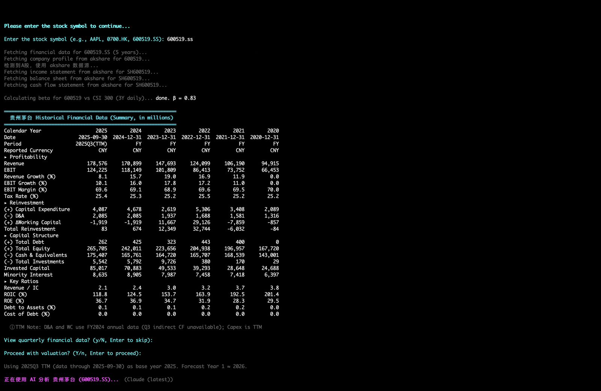
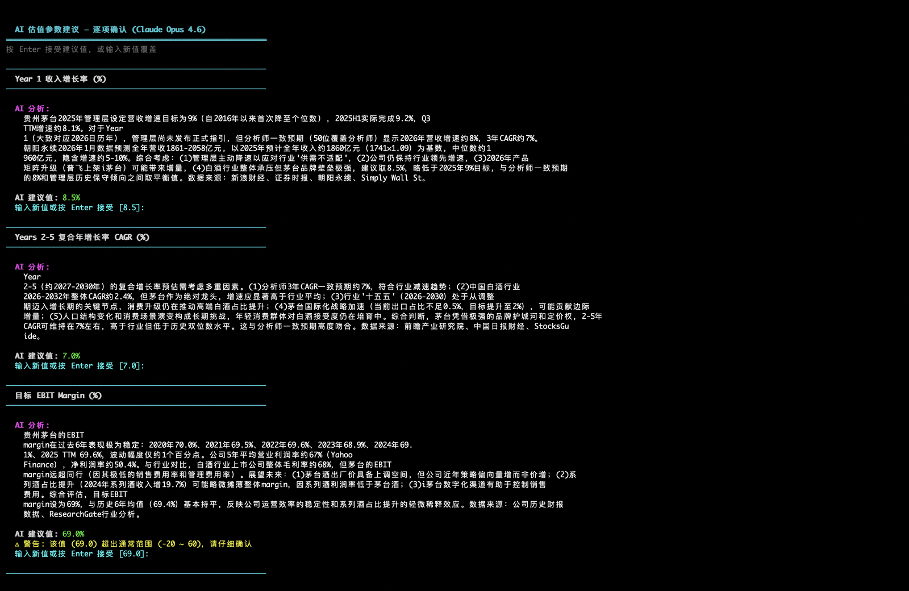
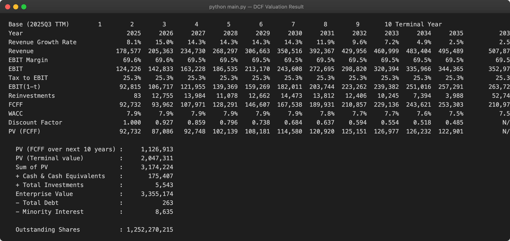
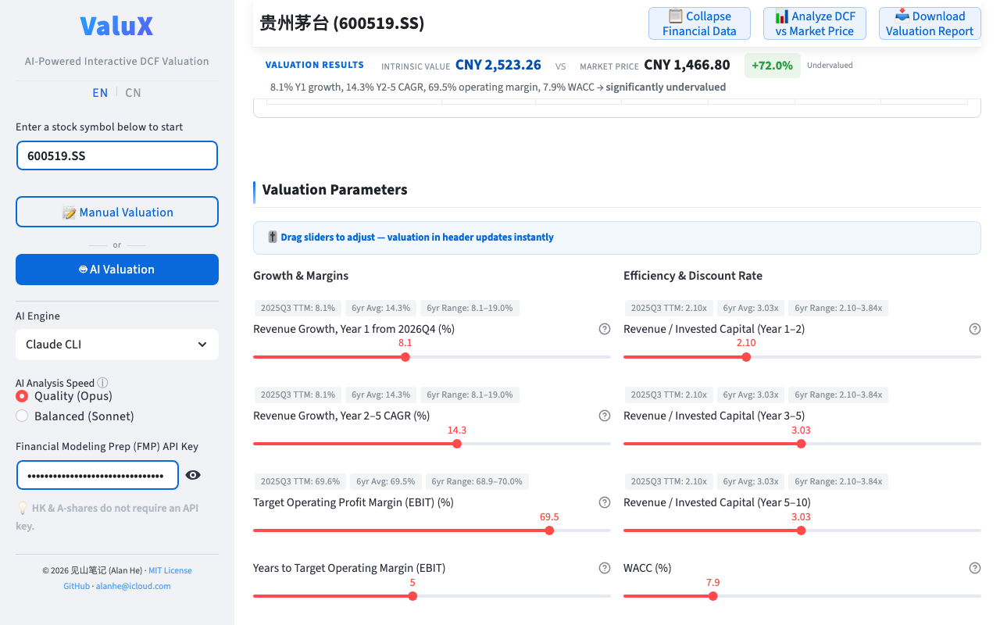

## Language
- [English](README.md)
- [中文](README_zh.md)

---

# ValuX

**AI-powered interactive DCF valuation for global stocks — standardized model, real-time parameter tuning, reproducible results. A-shares & HK stocks free, no API key needed.**

[](#demo)
[](LICENSE)
[](https://www.python.org/)

---

## What is ValuX?

ValuX is an AI-powered stock valuation tool built on a **standardized DCF engine** — 10-year explicit forecast, terminal value, WACC, and sensitivity analysis in a fixed, reproducible framework. Unlike asking an LLM to "value this stock" (where every conversation may use a different method, different discount rates, or even different valuation approaches), ValuX produces **consistent, comparable results** you can trust for investment decisions.

**What sets ValuX apart from raw AI chat?**

- 🔧 **Standardized DCF Engine** — A fixed valuation framework (10-year FCFF, WACC, terminal value) ensures every valuation is reproducible and comparable across companies and time periods. No more guessing which method the AI used this time.
- 📊 **Structured Data Pipeline** — Automatically fetches historical financials, calculates TTM metrics, WACC, and historical reference ranges. A-shares and HK stock data are free for everyone.
- 🖥️ **Terminal + Local Web GUI** — Two ways to run locally: a feature-rich **terminal CLI** with AI copilot, or a **local web dashboard** for visual, interactive parameter tuning with sliders and real-time charts — accessible at `http://localhost:8501` in your browser. Both share the same valuation engine and data pipeline.
- 🌐 **Cloud Web App** — Don't want to install anything? Try the lightweight cloud version at [valux-dcf.streamlit.app](https://valux-dcf.streamlit.app) — no installation, no API key needed. Supports A-shares and HK stocks in manual mode. (AI features are not available in the cloud version.)

Think of it as having an equity research analyst sitting next to you: AI searches for earnings guidance, analyst consensus, and industry benchmarks, then suggests valuation parameters — but the underlying model is always rigorous, transparent, and under your control.

---

## Key Features

- **Multi-Engine AI Copilot** — Supports three AI engines: [Claude Code](https://docs.anthropic.com/en/docs/claude-code), [Gemini CLI](https://github.com/google-gemini/gemini-cli), and [Qwen Code](https://github.com/QwenLM/qwen-code). Auto-detects installed engines (priority: Claude > Gemini > Qwen), or specify one with `--engine`. AI analyzes the company, searches the web for analyst forecasts and earnings guidance, and suggests DCF parameters with detailed reasoning. You review and adjust each parameter interactively.
- **Manual Mode** — Prefer full control? Use `--manual` to input all parameters yourself. No AI engine or API key required.
- **Auto Mode** — Use `--auto` for a fully automated pipeline: AI analysis, parameter acceptance, and Excel export with no interaction.
- **Gap Analysis** — After valuation, AI compares your DCF result against the current stock price, searches for analyst price targets, explains potential reasons for the discrepancy, and provides a revised valuation.
- **Sensitivity Analysis** — Generates sensitivity tables for Revenue Growth vs EBIT Margin and WACC, showing the range of possible per-share valuations.
- **Excel Export** — Exports valuation results, historical data, financial statements, and AI gap analysis to a formatted Excel workbook.
- **Global Coverage** — Supports China A-shares, Hong Kong, US, Japan, and other global markets, with automatic WACC calculation based on country-specific risk-free rates and equity risk premiums.
- **Free Tier for A-shares & HK Stocks** — A-shares and HK stocks use free data sources (akshare / yfinance), no API key required. Combined with manual mode, you get a fully free valuation workflow.

---

## How It Works

```
┌──────────────────────────────────────────────────────────────┐
│  Enter stock symbol  →  Fetch annual historical financials   │
│                          ↓                                   │
│  Display historical data summary (with TTM if available)     │
│                          ↓                                   │
│  [Optional] View quarterly data as reference                 │
│                          ↓                                   │
│  AI Copilot: search web → suggest parameters → you review    │
│                          ↓                                   │
│  Calculate DCF → intrinsic value per share                   │
│                          ↓                                   │
│  Sensitivity analysis (Revenue Growth × EBIT Margin, WACC)   │
│                          ↓                                   │
│  [Optional] AI gap analysis: DCF vs current stock price      │
│                          ↓                                   │
│  [Optional] Export to Excel                                  │
└──────────────────────────────────────────────────────────────┘
```

---

## Demo

> Valuing Kweichow Moutai (600519.SS) — from data to intrinsic value in minutes.

### Terminal CLI

**Historical Financial Data**



**AI Copilot — Parameter Suggestions**



**DCF Valuation Result & Sensitivity Analysis**



### Local Web GUI

**Interactive Sliders with Real-Time Valuation**



---

## Data Sources

ValuX uses different data sources depending on the market, optimizing for data quality and cost:

| Market | Annual Data | Quarterly Data | API Key |
|--------|------------|----------------|---------|
| **China A-shares** | [akshare](https://github.com/akfamily/akshare) | akshare | **Not required** (free) |
| **Hong Kong** | [yfinance](https://github.com/ranaroussi/yfinance) | [FMP](https://financialmodelingprep.com/) | Annual: **free**; Quarterly: FMP key required |
| **US & Others** | [FMP](https://financialmodelingprep.com/) | FMP | FMP key required |

**Why multiple data sources?**
- **akshare** — Free, no API key needed. Provides original A-share financial statements with reliable data quality for accurate calculation of valuation metrics.
- **yfinance** — Free, no API key needed. Provides comprehensive HK annual and TTM financial data with reliable quality (quarterly and semi-annual data not available).
- **FMP** — Paid, API key required. Primary data source for US and international stocks, providing financial statements, market data, company profiles, and risk premiums. Also provides HK quarterly financial data.

> **No FMP API key?** You can still query A-shares and HK annual data for free. Use `--manual` mode (terminal) or the local/cloud web app to input valuation parameters yourself — a fully free workflow.

---

## AI Engines

ValuX supports three AI engines. On startup, it auto-detects installed CLI tools (priority: Claude > Gemini > Qwen). You can also force a specific engine with `--engine`.

| Engine | CLI Tool | Install | Notes |
|--------|----------|---------|-------|
| **Claude** | [Claude Code](https://docs.anthropic.com/en/docs/claude-code) | `npm install -g @anthropic-ai/claude-code` | Default if available. Requires Anthropic account. |
| **Gemini** | [Gemini CLI](https://github.com/google-gemini/gemini-cli) | `npm install -g @google/gemini-cli` | Free with Google account login. |
| **Qwen** | [Qwen Code](https://github.com/QwenLM/qwen-code) | `npm install -g @anthropic-ai/qwen-code` | Free with qwen.ai account login. |

If no AI engine is detected, ValuX automatically falls back to manual mode.

---

## Running Modes

| Mode | Command | AI Required | Description |
|------|---------|-------------|-------------|
| **Copilot** (default) | `python main.py` | Yes | AI suggests each parameter with reasoning; you review and adjust interactively. |
| **Manual** | `python main.py --manual` | No | You input all valuation parameters yourself. Works without any AI engine or API key. |
| **Auto** | `python main.py --auto` | Yes | Fully automated: AI analysis → auto-accept parameters → auto-export Excel. No user interaction. |

Additional flags:
- `--engine claude|gemini|qwen` — Force a specific AI engine instead of auto-detection.
- `--apikey YOUR_KEY` — Pass FMP API key directly (alternative to `FMP_API_KEY` env variable).

---

## Installation

### 1. Clone the Repository

```bash
git clone https://github.com/alanhewenyu/ValuX.git
cd ValuX
```

### 2. Install Dependencies

Requires Python 3.8+.

```bash
pip install -r requirements.txt
```

### 3. Set Up FMP API Key (Optional)

Primarily used for US stock DCF valuation. Not required for A-shares or HK stock valuation.

Register at [Financial Modeling Prep](https://financialmodelingprep.com/) and set your API key:

```bash
# macOS / Linux
export FMP_API_KEY='your_api_key_here'

# Windows CMD
set FMP_API_KEY=your_api_key_here

# Windows PowerShell
$env:FMP_API_KEY="your_api_key_here"
```

### 4. Set Up AI Engine (Optional)

Install any one of the supported AI CLI tools:

```bash
# Option 1: Claude Code (recommended)
npm install -g @anthropic-ai/claude-code

# Option 2: Gemini CLI (free with Google account)
npm install -g @google/gemini-cli

# Option 3: Qwen Code (free with qwen.ai account)
npm install -g @anthropic-ai/qwen-code
```

If no AI engine is available, ValuX falls back to manual mode automatically.

### 5. Run

Make sure you're in the ValuX directory first:

```bash
cd ValuX
```

**Terminal CLI** — full-featured with AI copilot:

```bash
python main.py                      # AI copilot mode (default)
python main.py --manual             # Manual input mode
python main.py --auto               # Full auto mode
python main.py --engine gemini      # Force Gemini engine
```

**Local Web GUI** — visual interactive dashboard:

```bash
streamlit run web_app.py
```

Opens automatically in your browser at `http://localhost:8501`. Features interactive sliders for parameter tuning, real-time valuation charts, and side-by-side sensitivity analysis. If an AI engine is installed locally, AI copilot is also available in the web GUI.

---

## Usage

1. **Enter stock symbol** — e.g., `AAPL`, `600519.SS` (Moutai), `0700.HK` (Tencent)
2. **Review annual historical data** — The program fetches and displays the annual financial summary with TTM data (if available).
3. **View quarterly data** (optional) — Choose to view quarterly financial data as a reference before valuation.
4. **AI parameter generation** (or manual input) — AI suggests each parameter with reasoning; press Enter to accept or type a new value.
5. **View DCF results** — Intrinsic value per share and the full calculation breakdown.
6. **Sensitivity analysis** — Two tables: Revenue Growth vs EBIT Margin, and WACC sensitivity.
7. **Gap analysis** (optional) — AI analyzes why DCF value differs from market price.
8. **Export to Excel** (optional) — Saves everything to a formatted `.xlsx` file.

### Input Format

Percentage parameters (revenue growth, EBIT margin, tax rate, WACC) are entered as plain numbers: enter `10` for 10%, not `10%`.

---

## Key Valuation Parameters

| Parameter | Description |
|-----------|-------------|
| **Revenue Growth (Year 1)** | Next year's revenue forecast. AI prioritizes company earnings guidance, then analyst consensus. |
| **Revenue Growth (Years 2-5)** | Compound annual growth rate (CAGR) for years 2-5. |
| **Target EBIT Margin** | The EBIT margin the company is expected to reach at maturity. |
| **Convergence Years** | Years needed to reach the target EBIT margin from current level. |
| **Revenue/Invested Capital Ratio** | Capital efficiency ratio for different periods (Year 1-2, 3-5, 5-10). AI cross-validates against historical reinvestment data. |
| **Tax Rate** | Auto-calculated from historical data; adjustable. |
| **WACC** | Auto-calculated from risk-free rate, equity risk premium, and beta; adjustable. |
| **RONIC** | Return on new invested capital in the terminal period. Defaults to WACC (competitive equilibrium) or WACC + 5% for companies with durable competitive advantages. |

> **Note on EBIT**: For A-shares, EBIT is calculated from akshare raw data with non-operating items (investment income, fair value changes, etc.) excluded. For HK stocks, operating income is used directly; some companies may include material non-operating items that are not stripped out — review with caution.

---

## Why DCF Valuation Matters

Price is what you pay; value is what you get. DCF valuation estimates a company's intrinsic value by discounting future free cash flows — it's the foundation of value investing.

This tool focuses on three core drivers: **revenue growth**, **operating efficiency (EBIT margin)**, and **reinvestment**. As Buffett said, *"I would rather be vaguely right than precisely wrong."* Through sensitivity analysis, you can find the margin of safety even with imperfect assumptions.

---

## Contributing

Issues and pull requests are welcome. Contact: [alanhe@icloud.com](mailto:alanhe@icloud.com)

For more on company valuation, visit [jianshan.co](https://jianshan.co) or scan to follow on WeChat:


---

## License

MIT License. See [LICENSE](LICENSE) for details.
